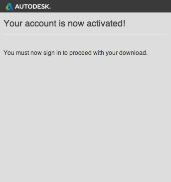
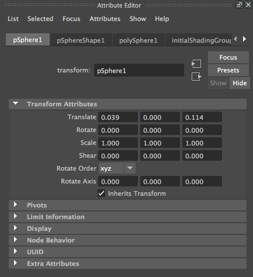
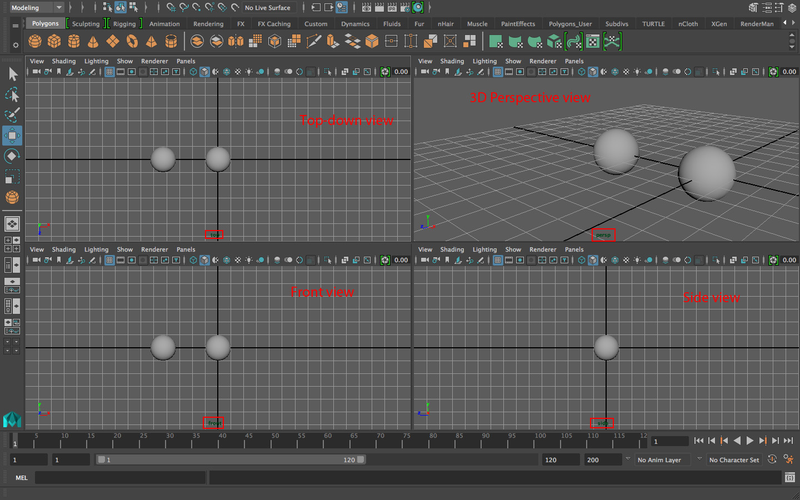

# INTRODUCTION

Welcome to Maya! The purpose of this guide is to just give you a basic overview of what you're looking at when you open Maya. Consider this a guided tour through Maya's user interface, but feel free to experiment with any buttons/functions that look interesting to you.

# GETTING MAYA

While UCBUGG provides lab computers with Maya installed, it's really important to have your own copy on your computer so that you can work from home on your own schedule.
This process will require that you have a valid berkeley.edu email address, so make sure you have it handy.
Registering with Autodesk
Open up a web browser and go to http://www.autodesk.com/education/free-software/maya.

Click 'Create Account'. This link will take you to a registration page. Make sure to fill out the "Email" field with your berkeley.edu email address or this process will not work. Once you have filled out the form, hit "Submit"

Autodesk will register your account and send you an activation email. Registration can take a few minutes, so don't worry if the email doesn't show up instantly. Once you get your email, click on the included activation link. You should see a "Your account is now activated!" message.

## DOWNLOADING MAYA

Once registration is complete, go back to http://students.autodesk.com/education/free-software/maya, log in with your newly created account, and fill out the second section.
From the version drop-down menu, select Maya 2016.

Select "English" from the language drop-down.
From the operating system drop-down menu, select which version you want to download. If you are on Windows, download either the 32-bit or 64-bit version, depending on your computer's processor. If you are on a Mac, just download the Mac OS X version. Make sure to write down your serial number and product, as you will need them during installation. Once you select your version, click the "broswer download" button. The download should start automatically, but if not, check the help links at the bottom of the page. Maya is a pretty big piece of software (2.0 GB) so make sure you have enough time to download the entire file. I suggest catching up on some reading while you wait.
Installing Maya
Once your download is complete, simply run the installer and follow the on screen instructions. The installer will ask for the serial number from the previous section. After you enter your serial number and product key, Maya will install. You are now the proud owner of Maya 2016.
A warning: Maya's activation process can take quite a while. If you encounter any errors, simply try again with the same data. It should eventually work.

## INSTALLING MENTAL RAY (IMPORTANT)

Once you have finished installing Maya, download the Mental Ray renderer plugin from this link:
http://knowledge.autodesk.com/support/maya/downloads/caas/downloads/content/mental-ray-plugin-for-maya-2016.html
A renderer is how you will produce the images from your 3D scene that will be the frames of your animation! We will go more into depth about different renderers later in the semester.

## MUDBOX

While you're at it, you can download Mudbox using the account you have now created as well. Mudbox is not required for our class, but you may find it very useful and we have resources if you want to learn how to use it as well.
http://www.autodesk.com/education/free-software/mudbox

Now let’s get on to using Maya.

# BASIC UI TERMINOLOGY

This is the viewport:

The viewport is a representation of what's in your scene. Almost everything in your scene will be viewed in the viewport. Here you can manipulate objects, animate characters, and even make cool effects like fire, water, and shattering objects.

The gray mesh in the middle is referred to as the grid. This grid is meant to orient you to your position. It will not be visible in the final video you produce.

**Shelf**

Note that everything in the shelf can be accessed from the top bar of your window screen; the shelf is just an easy way to quickly access some of the tools like making specific polygons, adding lights, rigging joints, etc.

**Toolbox**
This is the toolbox (there are shortcuts for its functions discussed below).

This contains the tools you need to manipulate basic attributes of objects (position, angle, size, etc.) through the move, rotate, and scale/resize tools.

**Dropdown Menu**

This changes the function of Maya to a different part of the pipeline. When it's in "modeling", most options in the topmost bar of your screen will be related to modeling. When it's "rigging" the options will be relevant to rigging, etc. This should give you an idea of how huge Maya's scope of capabilities is.

# CREATING OBJECTS

This part of the guide will take a brief look at how to make a polygon and edit its basic attributes.

1. Make sure your dropdown menu is in Modeling mode
2. Go to create>polygon primitives>sphere
   
3. Click and drag on the viewport to create a sphere of custom size (the more you drag, the bigger it will be).

   - You can also do this through the polygons menu in the shelf:
     

4. If you want to undo the creation of the sphere, do Command + z (command + shift + z will redo)
5. Check the attribute editor for the sphere:

   - To access the attribute editor, hold right click on the sphere and let go of right click when the mouse hovers over "pSphere1..."

   

You should then get this window on the right side of the screen:

Try clicking on the first tab on the left "pSphere1." There you will find several spaces with numbers where you can edit the attributes and you would see a corresponding change.

Notice how there's three boxes for every attribute: this is because there's three dimensions to every attribute (x, y, z). So if you edit those numbers, you should see the sphere changing in the viewport in a way that corresponds to the numbers you put. Feel free to explore changing numbers and seeing the effect on the sphere, or to change the sphere directly and see the effect on the numbers.

# MANIPULATING VIEWS

So now that you have an object, what if you want to take a look around the object?
Here are some valuable functions that will help you move around the viewport with ease:

- **Command/alt + left click drag** will rotate the viewport, allowing you the freedom to look in all angles
- **Scrolling the wheel in and out** will zoom the viewport in/out. Alternatively, you can do command/alt + right click drag in and out and it will zoom in/out
- **Alt + middle mouse drag** (clicking on the actual mouse wheel and holding) will pan around the scene
- If the camera moves too far away/is too zoomed in or out, click on an object in your scene and press **F**. This will focus the camera on that object, centering it in the middle of the viewport so that you are reoriented once again.

## DISPLAY OPTIONS FOR THE VIEWPORT

- If you look in the area below the shelf, there should be a sequence of icons:
  

For now, we'll focus on these buttons:

- Try clicking on these icons in order and watch what it does to the sphere/polygon you've created before.
- The wireframe is useful if you the object is complicated and you want to trace its edges better.
- The shaded is the default view.
- The wireframe on shaded is also helpful if you want to see the edges of an unselected object, and if you want to see a clear relationship between the edges of an object and its surface.

## SMOOTHING AND UNSMOOTHING

- Select your polygon and press "3" and notice how the object becomes smoother. This is most pronounced in objects with hard edges/corners, such as a cube. Here it is normally:
  

And here it is after selecting it and pressing "3" to smooth it:

Notice how it almost looks like a different object? We'll get into this in the modeling section in a lot more detail. For now, just know that "3" will smooth an object and "1" will unsmooth it again.

# MANIPULATING OBJECTS

Remember the toolbox on the left side of the screen? You can use it to manipulate your objects:

The hotkeys for these (very simple but very useful to remember):
**Q: selection mode**

- Generally this is used when you want to select something but not have the manipulation arrows onscreen.

**W: move tool**

- Use the arrows to move the object in whichever direction you like. Clicking and dragging in the middle where all three arrows intersect will cause the object to move in all 3 dimensions.

**E: rotate tool**

- Use the axis lines to rotate the object in whichever direction you like. Clicking between the lines will rotate the object in all 3 dimensions.

**R: scale/resize**

- Use the cube ends of the lines to resize the object in specific dimensions, or click and drag in the intersection point in the middle to resize the whole object in all three dimensions at once.

What if you want to make a copy of an object?

- Click on the polygon you made and press Command + d and the object will be duplicated at exactly the same point as the original object (which means it will be difficult to see). Now click "w" and move the duplicate out of the way so that you can see the two objects.

What if you want to select both objects at once?

- There's two ways:
  Select the first object and then shift + click the second object and both will be selected
  OR
  Click and drag a box around both objects and they'll both be selected

What if you want to objects to become just one object?

- Select both objects and go to mesh>combine
  

Be careful with this though, since you will NOT be able to select the separate objects again until you separate them manually. They are now considered one object. (An alternate way to combine objects is parenting, but that's in the modeling section).

What if you have a ton of objects in your scene and it's difficult to keep track of everything?

- Maya has you covered. Go to windows>outliner
  

This will then open a window that will show the default names of the objects in your scene, which isn't very useful if you have many objects. To remedy this, double click on one of the names of the objects listed in your outliner, and rename it something more appropriate (i.e. ball_1).

What if you want to delete an object?

- Just click the object and press delete/backspace. Again, if you'd like to undo, do command + z.
- Alternatively, you can click on the object's name in the list in the outliner and just press delete/backspace.

# DIFFERENT VIEWS OF THE SCENE

Since we are dealing with objects in three dimensions displayed on a 2d screen, it can be difficult to get a sense of depth of the objects you're making in the scene. Therefore, it is important to be cycling through views to make sure everything in the scene is exactly where you want it.

Maya has plenty of options for this.

If you press the spacebar, your viewport will be split into four like this:

If you look at the bottom of each one of the views (boxed in red) you can see the label for what view it is.

Something important to keep in mind: everything but the "persp" view is in 2D, meaning that you can't rotate/tumble these views the same you rotate in the "persp" view because they're flat. This is absolutely essential when you're modeling something based off of a reference, and your "side" view and "front" view have to be in proportion.

Hover your mouse over one of the views and press spacebar. That should make that window take over the viewport.

If you want to get out of that, press spacebar again and you'll be back to the four screens. Hover over "persp" and press spacebar to go back to the 3d view.

# ALTERING PARTS OF AN OBJECT

- Make a polygon (sphere, cube, pipe, etc.)
- Hold right click over it and you should see this:
  

The main buttons to pay attention to for now are "Vertex" "Edge" "Face" and "Object Mode."

- If you let go of right click over "Vertex" the lines of the object will turn blue, indicating that you're editing parts of the object. The intersection dots in the object's lines will now be purple, allowing you to change their positions.
- Try clicking a vertex and then pressing "w" to go into the move tool and move them in/out to get a sense of what vertices contribute to the shape of the object.
- In "Edge" mode you'll be able to alter the lines on an object (an edge is the line between two vertices)
- In "Face" mode you'll be able to alter the spaces between the lines on the object (faces are the areas of the mesh surrounded by four vertices/edges.)
- To go back to being able to manipulate the object as a whole, go into "Object Mode." Now the lines will be green, indicating that the object as a whole is being altered and not just specific parts of it.

## A TINY BIT OF MODELING

- For the purpose of your application assignment (making a robot), here's a little bit of modeling tools to help you.

From what you've seen in the previous section, it seems that the lines on an object dictate its shape--so how do you add lines/edges?

1. Select the object.
2. Go to mesh tools —> insert edge loop
   

Now click on one of the edges of the polygon, and you'll find that a line has formed throughout the object perpendicular to the edge you selected. You have now added an edge loop. On a sphere this isn't very helpful, but in other situations, it is absolutely essential to be able to get your model where it needs to be.

What if you want to bring out a face without pulling the surrounding faces with it?
So if you go into "face" mode and just select a face and move it outward, it will look something like this:

Notice how the surrounding faces get affected when you pull that one face out? What if you don't want them to be affected?
The answer to that is the extrude tool.

Select the face, and instead of pulling it out immediately, go to edit —> mesh extrude and if you pull out the face, it will look like this:

Do you see the difference? The extrude tool is very helpful in connecting objects/extracting shapes from them. For example, as you work on your robot, if it has a torso that needs arms you can take the faces on the sides (the ones that are small enough to be arms) and extrude them out instead of making the arms simple pipes/cylinders.

The danger with this though is extruding twice. Be careful to only extrude once per movement. So extrude--move--extrude--move, but it should never be extrude--extrude--move. That would cause double faces on top of each other, which would mess up the smoothing of the model.

Let us know if you have any questions! Feel free to explore!
